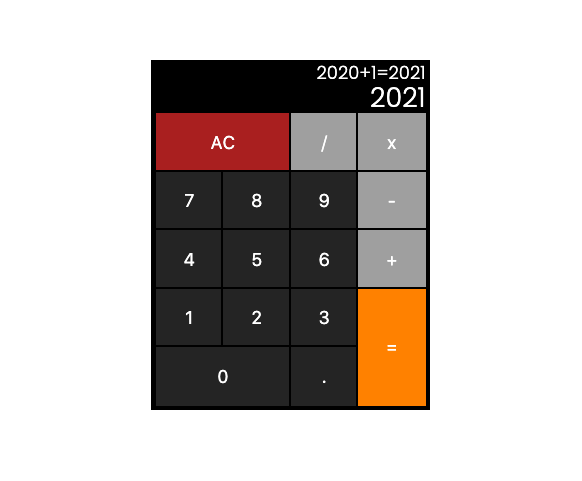

**JavaScript Calculator**
4 of 5 projects for the freeCodeCamp FrontEnd Libraries Certification.

- JavaScript Calculator: [Live Preview]() | [Requirements](https://www.freecodecamp.org/learn/front-end-libraries/front-end-libraries-projects/build-a-javascript-calculator)

## Screen

